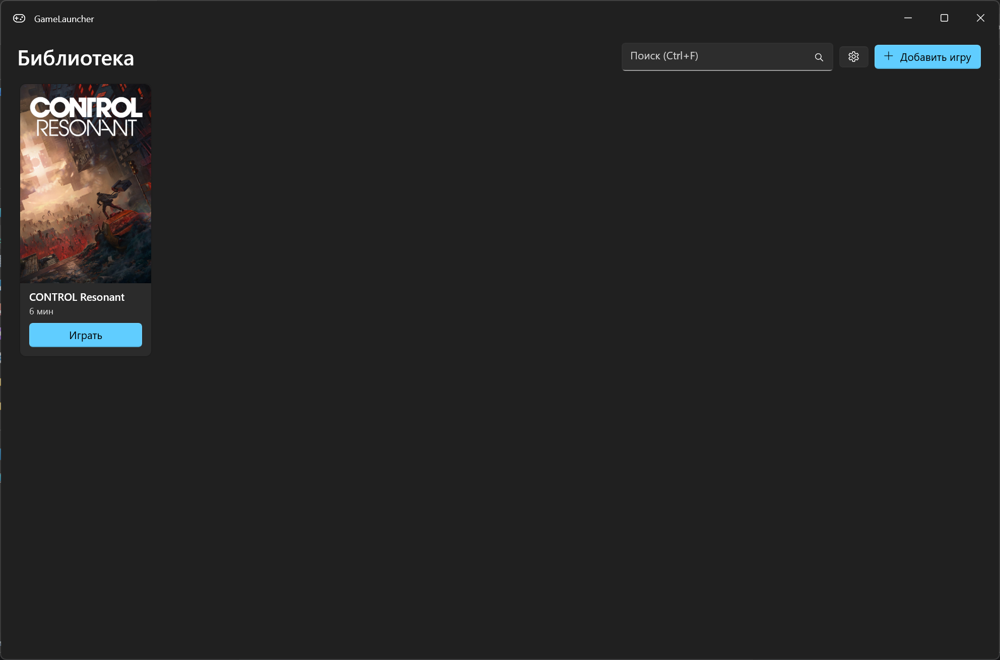
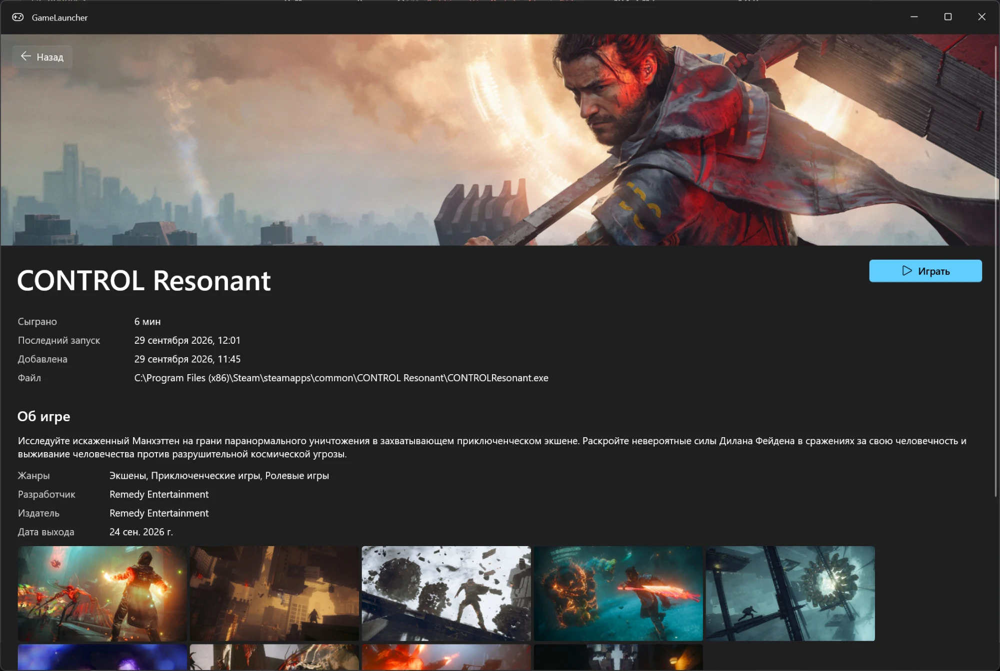
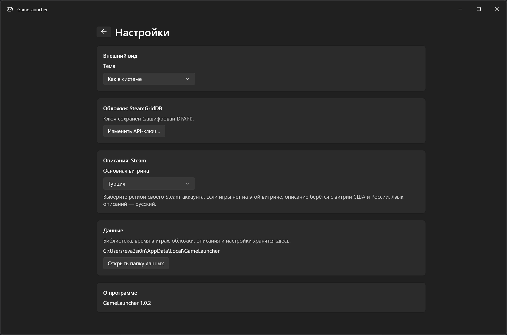

# GameLauncher

Нативный лаунчер игр для Windows 11 на WinUI 3 (.NET 10). Интерфейс на русском.







## Возможности

- **Библиотека:** добавление игры по `.exe` — кнопкой или перетаскиванием exe / ярлыка `.lnk` в окно (название берётся из имени ярлыка), переименование, удаление, поиск (Ctrl+F; регистр не важен, «ё» = «е», слова в любом порядке), сортировка: недавние, по времени в игре, по названию, по дате добавления (выбор запоминается).
- **Запуск:** кнопка «Играть» запускает игру из её папки — многие игры без этого не стартуют. Игры, требующие прав администратора, показывают обычный запрос UAC.
- **Учёт времени в игре** — см. [ниже](#как-считается-время).
- **Статистика на странице игры:** за 7 и 30 дней, число сессий, средняя и самая долгая, график по дням за 30 дней, последние 10 сессий. История сессий копится с версии 1.2 — раньше наигранное время есть только в общей сумме.
- **Экран «Статистика»** (кнопка с графиком в шапке): по всем играм за неделю, месяц или всё время — сыграно, сессий, разных игр, график по дням, «Больше всего играли» (клик — страница игры).
- **Трей:** крестик прячет окно в трей, время игр продолжает считаться; выход — правый клик по значку → «Выход». Можно запускать вместе с Windows (сразу в трей).
- **Обложки и баннеры** из [SteamGridDB](https://www.steamgriddb.com/). Нужен свой бесплатный API-ключ. Без ключа на карточке — иконка из exe.
- **Страница игры** (клик по карточке): баннер, время, последний запуск, описание, жанры, разработчик, издатель, дата выхода и скриншоты из Steam Store на русском.
- **Резервная копия:** каждый день автоматически (библиотека, история сессий и настройки, последние 7), вручную — полная копия в zip с обложками и описаниями; восстановление — в настройках.
- **Настройки** (шестерёнка): тема (как в системе / светлая / тёмная), трей и автозапуск, ключ SteamGridDB, витрина Steam, папка данных, резервные копии, версия.
- Фон Mica, окно запоминает размер, положение и «развёрнуто» между запусками.

## Управление

| Действие | Как |
|---|---|
| Добавить игру | «Добавить игру» в шапке → выбрать `.exe`, или перетащить в окно библиотеки exe или ярлык `.lnk` (можно несколько сразу) |
| Запустить | «Играть» на карточке или на странице игры |
| Открыть страницу игры | Клик по карточке |
| Переименовать, удалить, найти / убрать обложку | Правый клик по карточке (на странице игры — кнопками) |
| Поиск | Ctrl+F или поле в шапке |
| Сортировка | Список слева от поиска; «Недавние» и «По времени» сами пересортируются после игры |
| Скриншот крупно | Клик по скриншоту на странице игры, листать стрелками |
| Назад в библиотеку | «Назад» или Esc (со страницы игры, из статистики и настроек) |
| Настройки | Шестерёнка в шапке |
| Статистика | Кнопка с графиком в шапке; период — список справа |
| Свернуть в трей | Крестик окна (в настройках можно вернуть обычное закрытие) |
| Открыть из трея | Клик по значку или повторный запуск `GameLauncher.exe` |
| Выйти | Правый клик по значку в трее → «Выход» |

Удаление убирает игру только из библиотеки — файлы игры на диске не трогаются.

## Установка и обновление

Ставить ничего не нужно: скачайте `GameLauncher-<версия>-win-x64.zip` со страницы
[Releases](https://github.com/eva3si0n/GameLauncher/releases), распакуйте в любую папку и запустите `GameLauncher.exe`.
Приложение self-contained (внутри .NET и Windows App SDK), нужна Windows 11 x64.

Подписи у exe нет, поэтому SmartScreen предупреждает о файлах, скачанных из интернета («Неизвестный издатель»).
Чтобы предупреждения не было, разблокируйте zip **до распаковки**: правой кнопкой → Свойства → «Разблокировать» → ОК,
или в PowerShell — `Unblock-File .\GameLauncher-<версия>-win-x64.zip`. Уже распакованную папку:
`Get-ChildItem <папка> -Recurse | Unblock-File`. Без этого можно нажать «Подробнее» → «Выполнить в любом случае».

Для обновления замените папку с программой: все данные хранятся отдельно (см. [Данные](#данные)).

## Как считается время

- Сессия начинается после «Играть», когда появляется процесс, чей exe лежит **в папке игры или её подпапках**, и идёт, пока жив хоть один такой процесс. Поэтому игра со стартером (стартер → `bin\x64\game.exe`) считается одной сессией.
- Пауза между стартером и игрой до 10 секунд сессию не обрывает.
- Если за 2 минуты после «Играть» процесс так и не появился, запуск не засчитывается.
- Время сохраняется раз в минуту и при закрытии лаунчера — падение лаунчера теряет не больше минуты. Вместе со временем записывается сессия (начало и конец) — из них строится статистика.

**Ограничения:** время считается, только пока лаунчер запущен (свёрнутый в трей тоже считается), и только для игр, запущенных из лаунчера. При выключении или перезагрузке Windows время идущих игр сохраняется. Если exe лежит прямо в корне диска, засчитывается только он сам.

## Обложки: ключ SteamGridDB

1. Войдите на [steamgriddb.com](https://www.steamgriddb.com/) (через Steam).
2. Откройте [Preferences → API](https://www.steamgriddb.com/profile/preferences/api) и скопируйте ключ.
3. В лаунчере: Настройки → «Изменить API-ключ…». Ключ проверяется запросом к SteamGridDB и хранится на этом компьютере зашифрованным (DPAPI, только для вашей учётной записи Windows).

Правый клик по игре → «Найти обложку…»: выберите игру, затем обложку. Вместе с обложкой скачивается баннер для страницы игры и, если игра есть в Steam, описание.

## Описания из Steam

Описание, жанры и скриншоты берутся из Steam Store (ключ не нужен). Если после выбора обложки описание не появилось — на странице игры нажмите «Найти описание в Steam…» и выберите игру вручную.

**Витрина** (Настройки → «Основная витрина»): поставьте регион своего Steam-аккаунта (по умолчанию — Турция). Steam не отдаёт данные об игре, если она не продаётся в выбранном регионе, поэтому при неудаче лаунчер пробует ещё витрины США и России. Язык описаний — всегда русский.

Скриншоты не сохраняются на диск и грузятся из Steam при просмотре — без интернета их не будет.

## Данные

Всё хранится в `%LocalAppData%\GameLauncher` (Настройки → «Открыть папку данных»):

| Файл / папка | Что внутри |
|---|---|
| `library.json` | Библиотека: игры, пути, время, последний запуск |
| `sessions.json` | История игровых сессий: игра, начало, конец |
| `settings.json` | Тема, трей, сортировка, витрина Steam, размер и положение окна |
| `steamgriddb.key` | API-ключ SteamGridDB, зашифрованный DPAPI |
| `artwork\` | Обложки и баннеры |
| `info\` | Описания из Steam |
| `backups\` | Автокопии: `auto-<дата>.zip` (раз в день, последние 7) и `before-restore-<время>.zip` (состояние перед восстановлением, последние 3) |
| `crash.log` | Появляется, только если приложение упало |

Автозапуск — значение `GameLauncher` в реестре `HKCU\Software\Microsoft\Windows\CurrentVersion\Run`; выключается переключателем в настройках. Перед удалением папки с лаунчером выключите автозапуск. Если папку перенесли, путь в автозапуске исправится при следующем запуске.

**Резервная копия** — zip с `library.json`, `settings.json`, `sessions.json`, `info\` и `artwork\` (у автокопий — без `info\` и `artwork\`). Ключ SteamGridDB не копируется: он зашифрован DPAPI для пользователя Windows и после переустановки системы всё равно не расшифруется — введите его заново. Восстановление заменяет данные и перезапускает лаунчер; пока идёт игра, оно недоступно.

Если `library.json` или `sessions.json` окажется повреждён, лаунчер отложит его рядом (`<файл>.corrupt-<время>`), начнёт этот файл заново и сообщит об этом. Повреждённая история на общее время игр («Сыграно») не влияет. Вернуть данные можно из автокопии (см. ниже «Если что-то не работает»).

## Если что-то не работает

- **Приложение закрылось с ошибкой** — пришлите `crash.log` из папки данных.
- **«Описание не найдено»** — в сообщении указан AppID; попробуйте выбрать другую игру в поиске или сменить витрину в настройках.
- **Ошибка SteamGridDB про ключ** — проверьте ключ в настройках.
- **Пропала библиотека или время** — Настройки → «Восстановить из копии…» и выберите автокопию из папки `backups` (кнопка «Открыть папку автокопий») или свою полную копию. Текущие данные перед этим тоже сохраняются в `backups`.
- **Перетащенный ярлык не добавился** — интернет-ярлыки `.url` (Steam, Epic) и ярлыки на лаунчеры магазинов не указывают на exe игры: перетащите exe из папки игры. Аргументы из ярлыка (`-dx11` и т. п.) не сохраняются.
- **Время не посчиталось** — игра должна быть запущена кнопкой «Играть», а лаунчер — запущен (можно в трее); exe процесса игры должен лежать в папке добавленного exe или её подпапках.
- **Статистика пустая** — история сессий копится с версии 1.2: после обновления поиграйте, и она появится. Время, наигранное раньше, есть только в «Сыграно».
- **Не видно значка в трее** — Windows 11 прячет новые значки за стрелкой ^ в углу панели задач; значок можно перетащить из-под стрелки на панель или включить в Параметры → Персонализация → Панель задач (раздел со значками в углу панели задач).
- **Лаунчер не запускается вместе с Windows** — проверьте, что он не выключен в Параметры → Приложения → Автозагрузка (этот переключатель Windows хранит отдельно от настройки лаунчера).

## Планы

Возможные доработки (порядок не определён):

- учёт игр, запущенных не из лаунчера.

Игры добавляются только вручную (по `.exe`) — автоимпорт библиотек Steam, Epic и GOG не планируется.

## Выпуск версии

`.github/workflows/release.yml`: сборка, тесты, смоук-запуск и GitHub Release с zip. Запуск — push тега вида `v1.2.3`
или вручную: Actions → Release → Run workflow, указать версию `1.2.3` (тег создастся сам). Версия из тега попадает в «О программе».

## Сборка

Требуется .NET SDK 10 (см. `global.json`).

```powershell
dotnet build GameLauncher.slnx -c Release
dotnet test --project tests/GameLauncher.Core.Tests
dotnet publish src/GameLauncher.App -c Release -r win-x64 -o artifacts/GameLauncher
```

`GameLauncher.App` собирается только на Windows. `GameLauncher.Core` и тесты собираются на любой ОС.
CI (`.github/workflows/ci.yml`) на каждом PR собирает, гоняет тесты, делает publish, проверяет сведения о файле и иконку exe, запускает приложение (смоук-тесты: обычный запуск, второй экземпляр, запуск в трей с `--tray`) и выкладывает zip в артефакты (7 дней).

## Структура

- `src/GameLauncher.Core` — логика без зависимостей от Windows:
  - `Library` — игры, хранилище `library.json`, поиск, сортировка, параметры запуска, добавление перетаскиванием (exe и ярлыки `.lnk`), удаление игры со всеми её данными;
  - `PlayTime` — учёт времени (сессии, сопоставление процессов с папкой игры), история сессий `sessions.json`, расчёты статистики;
  - `Artwork` — клиент SteamGridDB, кэш картинок;
  - `GameInfo` — клиент Steam Store, хранилище описаний;
  - `Settings` — настройки, размер и положение окна;
  - `Backup` — резервные копии: создание, проверка, восстановление, ежедневные автокопии;
  - `Startup` — аргументы запуска (`--tray`, `--wait-pid`) и логика автозапуска.
- `src/GameLauncher.App` — UI на WinUI 3 + CommunityToolkit.Mvvm и Windows-реализации: процессы (`QueryFullProcessImageName`), DPAPI, иконки exe, диалоги, значок в трее (Shell_NotifyIcon), автозапуск через реестр.
- `tests/GameLauncher.Core.Tests` — тесты xUnit v3 (HTTP-клиенты — на подставных ответах).
- `tools/icon` — генератор иконки приложения (`src/GameLauncher.App/Assets`); геймпад — `xbox_controller` из [Fluent UI System Icons](https://github.com/microsoft/fluentui-system-icons) (MIT). Нужны Pillow и cairosvg.

## Лицензия

[MIT](LICENSE).
